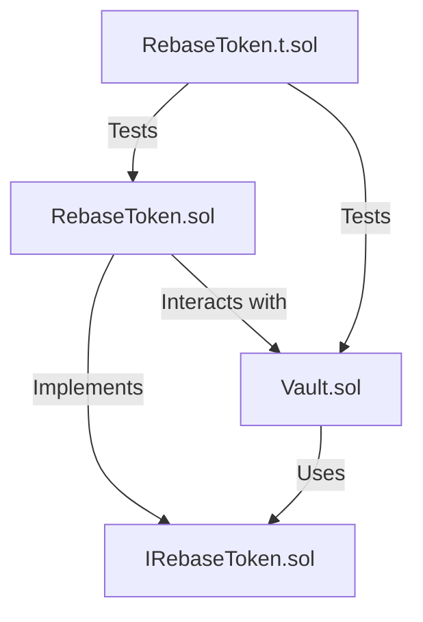

# Rebase Token Project

## Table of Contents
- [Overview](#overview)
- [Prerequisites](#prerequisites)
- [Project Structure](#project-structure)
- [Contracts](#contracts)
- [Scripts](#scripts)
- [Testing](#testing)
- [Setup and Installation](#setup-and-installation)
- [Usage](#usage)
- [Building](#building)
- [Running Tests](#running-tests)
- [Deploying](#deploying)
- [Contributing](#contributing)
- [License](#license)

## Overview
The Rebase Token project is a Solidity-based implementation of a cross-chain rebase token system. It incentivizes users to deposit assets into a vault, earning interest in the form of additional tokens. The system features a unique interest rate mechanism that can only decrease over time, with each user assigned the global interest rate at the time of their deposit or token receipt.

Key features:
- **Rebase Mechanism**: Automatically adjusts token balances based on accrued interest.
- **Vault Integration**: Users can deposit ETH to mint tokens and redeem tokens for ETH.
- **Access Control**: Restricted minting and burning to authorized roles.
- **Interest Rate Management**: Global interest rate can only be decreased by the contract owner.

## Prerequisites
To work with this project, ensure you have the following installed:
- **Node.js** (v16 or higher)
- **Foundry** (latest version recommended)
- **Git**
- **Solidity Compiler** (version ^0.8.24)
- **Ethereum Wallet** (e.g., MetaMask for deployment)
- **Access to an Ethereum node** (e.g., Infura, Alchemy, or local node like Hardhat)

Optional:
- **OpenZeppelin Contracts** (already included via imports)
- **IDE with Solidity support** (e.g., VS Code with Solidity extension)

## Project Structure
```
rebase-token/
├── src/
│   ├── RebaseToken.sol        # Core rebase token contract
│   ├── Vault.sol             # Vault contract for deposits and withdrawals
│   ├── Interfaces/
│   │   └── IRebaseToken.sol  # Interface for RebaseToken
├── test/
│   └── RebaseToken.t.sol     # Test suite for RebaseToken and Vault
├── foundry.toml              # Foundry configuration file
└── README.md                 # Project documentation
```

### Diagram


## Contracts
### RebaseToken.sol
The core contract implementing the ERC20 standard with rebase functionality:
- **Inheritance**: Inherits from OpenZeppelin's `ERC20`, `Ownable`, and `AccessControl`.
- **Key Features**:
  - Manages a global interest rate (`s_interestRate`) that can only decrease.
  - Tracks user-specific interest rates and last update timestamps.
  - Handles minting and burning of tokens with accrued interest calculations.
  - Supports token transfers with interest rate inheritance.
- **Key Functions**:
  - `setInterestRate(uint256)`: Sets a new global interest rate (only owner, must decrease).
  - `mint(address, uint256)`: Mints tokens with accrued interest (requires `MINT_AND_BURN_ROLE`).
  - `burn(address, uint256)`: Burns tokens with accrued interest (requires `MINT_AND_BURN_ROLE`).
  - `balanceOf(address)`: Returns balance including accrued interest.
  - `principleBalanceOf(address)`: Returns the principal balance (excluding interest).
  - `getInterestRate()`: Returns the current global interest rate.
  - `getUserInterestRate(address)`: Returns a user's specific interest rate.

### Vault.sol
The vault contract for depositing and redeeming tokens:
- **Key Features**:
  - Allows users to deposit ETH to mint Rebase Tokens.
  - Allows users to redeem tokens for ETH.
  - Emits events for deposits and redemptions.
- **Key Functions**:
  - `deposit()`: Mints tokens equal to deposited ETH.
  - `redeem(uint256)`: Burns tokens and sends ETH to the user.
  - `getRebaseTokenAddress()`: Returns the address of the RebaseToken contract.

### IRebaseToken.sol
An interface defining the core functions of the RebaseToken contract:
- `mint(address, uint256)`: Mints tokens to a user.
- `burn(address, uint256)`: Burns tokens from a user.
- `balanceOf(address)`: Returns a user's token balance.

## Scripts
Currently, no standalone deployment scripts are provided in the project. Deployment can be handled via Foundry's `forge create` command or custom scripts (see [Deploying](#deploying)).

## Testing
The project includes a comprehensive test suite in `RebaseToken.t.sol` using Foundry's testing framework. Tests cover:
- **Deposit Linearity**: Verifies that deposits correctly mint tokens and interest accrues linearly over time.
- **Redemption**: Tests immediate redemption and redemption after time with interest.
- **Transfers**: Ensures token transfers correctly handle balances and interest rate inheritance.
- **Access Control**: Verifies that only authorized accounts can mint, burn, or set interest rates.
- **Interest Rate Rules**: Confirms that the interest rate can only decrease.
- **Getters**: Tests `getInterestRate`, `getUserInterestRate`, and `principleBalanceOf` for accuracy.

## Setup and Installation
1. **Clone the Repository**:
   ```bash
   git clone https://github.com/your-username/rebase-token.git
   cd rebase-token
   ```

2. **Install Foundry** (if not already installed):
   ```bash
   curl -L https://foundry.paradigm.xyz | bash
   foundryup
   ```

3. **Install Dependencies**:
   The project uses OpenZeppelin contracts, which are imported via npm or git submodules. Install them:
   ```bash
   forge install openzeppelin/openzeppelin-contracts
   ```

4. **Configure Foundry**:
   Ensure `foundry.toml` is set up with the correct Solidity version (`0.8.24`) and remappings for OpenZeppelin:
   ```toml
   [profile.default]
   src = 'src'
   out = 'out'
   libs = ['lib']
   solc_version = '0.8.24'
   ```

## Usage
1. **Deploy Contracts**:
   Deploy `RebaseToken` and `Vault` contracts (see [Deploying](#deploying)).
2. **Grant Roles**:
   The `Vault` contract needs the `MINT_AND_BURN_ROLE` to mint and burn tokens. Call `RebaseToken.grantMintAndBurnRole(vaultAddress)` as the owner.
3. **Interact with the Vault**:
   - **Deposit**: Send ETH to `Vault.deposit()` to mint tokens.
   - **Redeem**: Call `Vault.redeem(amount)` to burn tokens and receive ETH.
4. **Manage Interest Rate**:
   As the owner, call `RebaseToken.setInterestRate(newRate)` to adjust the global interest rate (must be lower than the current rate).
5. **Query Balances**:
   Use `RebaseToken.balanceOf(user)` to check a user's balance with accrued interest or `principleBalanceOf(user)` for the principal balance.

## Building
Compile the contracts using Foundry:
```bash
forge build
```
This compiles all Solidity files in the `src/` directory and outputs artifacts to the `out/` directory.

## Running Tests
Run the test suite using Foundry:
```bash
forge test
```
For verbose output:
```bash
forge test -vv
```
The test suite in `RebaseToken.t.sol` covers all major functionalities, including edge cases like maximum uint256 redemption and interest rate restrictions.

## Deploying
To deploy the contracts to a network (e.g., Ethereum mainnet, Sepolia testnet):
1. **Configure Environment**:
   Create a `.env` file with your private key and RPC URL:
   ```env
   PRIVATE_KEY=your_private_key
   RPC_URL=https://your.ethereum.node
   ```
2. **Deploy RebaseToken**:
   ```bash
   forge create src/RebaseToken.sol:RebaseToken --rpc-url $RPC_URL --private-key $PRIVATE_KEY
   ```
   Note the deployed contract address.
3. **Deploy Vault**:
   ```bash
   forge create src/Vault.sol:Vault --rpc-url $RPC_URL --private-key $PRIVATE_KEY --constructor-args <RebaseTokenAddress>
   ```
   Replace `<RebaseTokenAddress>` with the address from step 2.
4. **Grant Mint and Burn Role**:
   Use a script or a tool like Etherscan to call `RebaseToken.grantMintAndBurnRole(vaultAddress)` with the deployed Vault address.

## Contributing
Contributions are welcome! To contribute:
1. Fork the repository.
2. Create a feature branch (`git checkout -b feature/your-feature`).
3. Commit your changes (`git commit -m 'Add your feature'`).
4. Push to the branch (`git push origin feature/your-feature`).
5. Open a pull request.

Please ensure all tests pass and include new tests for added functionality.

## License
This project is licensed under the MIT License. See the `SPDX-License-Identifier: MIT` in each contract file for details.

---

This README provides a comprehensive guide to the Rebase Token project, covering its functionality, setup, and usage. Let me know if you need further details or additional sections!